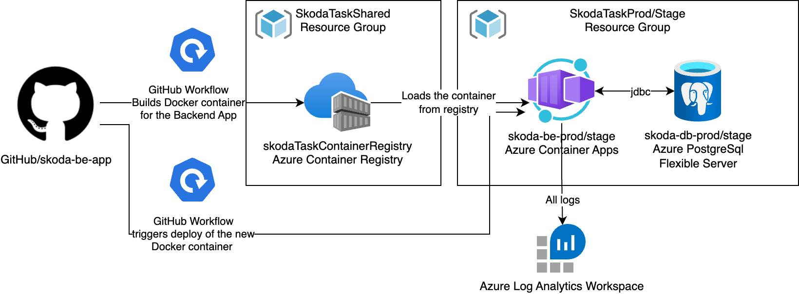

# Škoda Task

## Backend

## Deployment  & CI/CD
- Project is automatically deployed to Azure. F Container app.
- Each push to the master branch is **automatically** deployed to the stage environment, pipeline for the production must be **manually** started.

### Stage
[Swagger UI - Stage](https://skoda-be-prod.livelyisland-54db95f6.westeurope.azurecontainerapps.io/api/v1/swagger-ui/index.html)

**DB:** `skoda-db-stage.postgres.database.azure.com`

### Production
[Swagger UI - Production](https://skoda-be-stage.gentlecliff-615a9455.westeurope.azurecontainerapps.io/api/v1/swagger-ui/index.html)

**DB:** `skoda-db-prod.postgres.database.azure.com`
